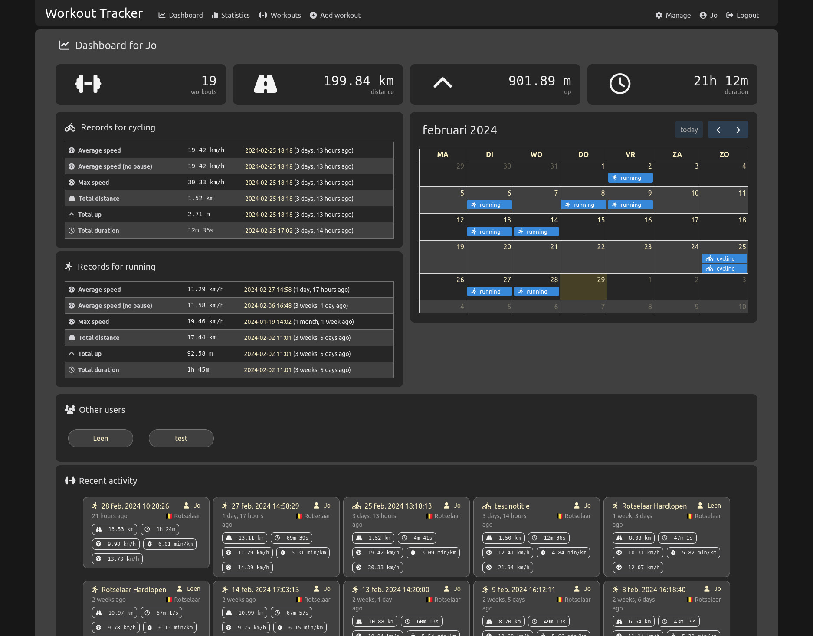
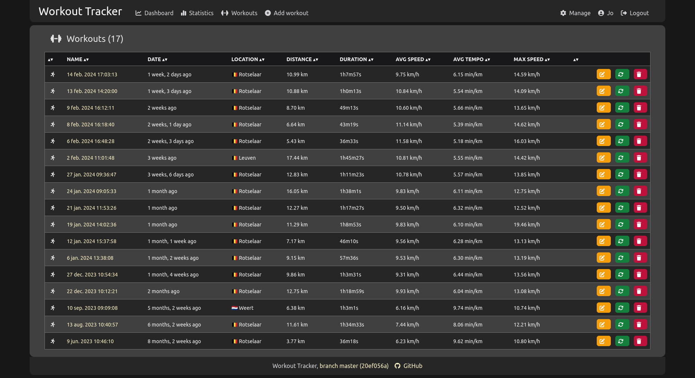
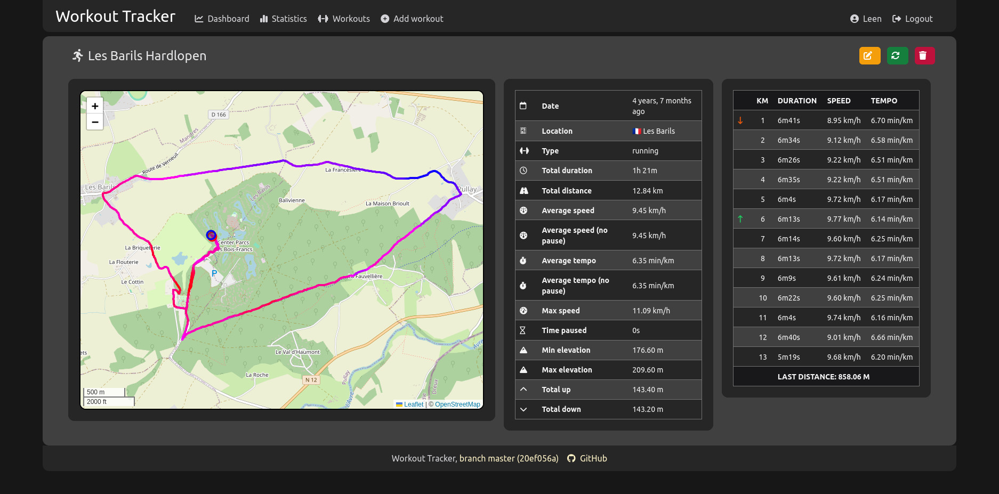
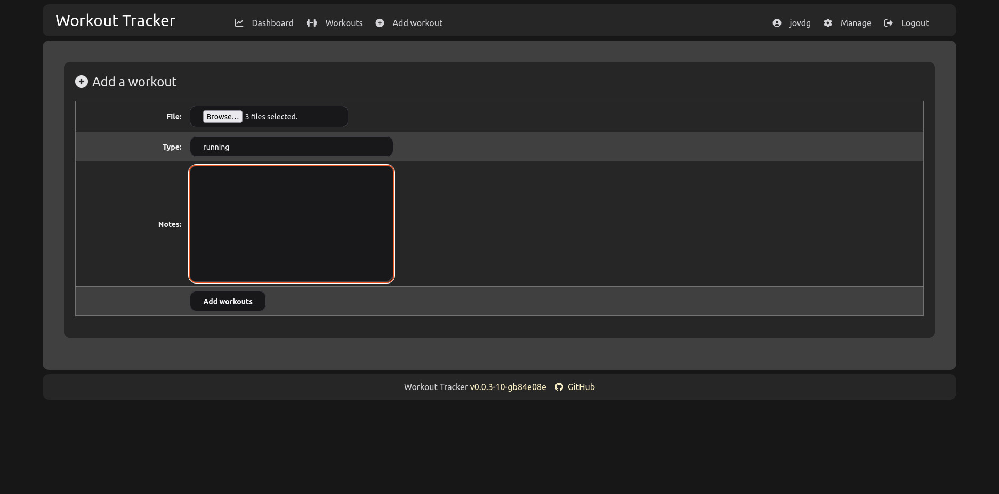
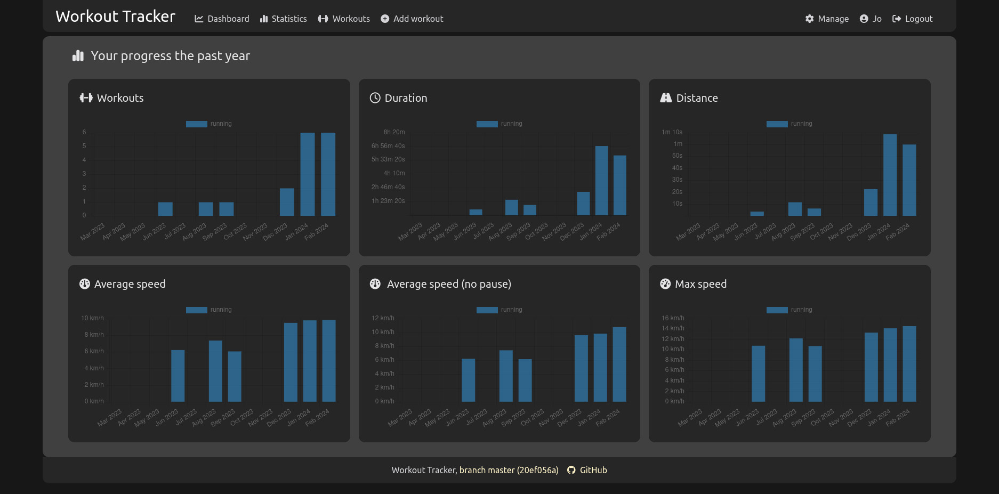

A workout tracking web application for personal use (or family, friends), geared towards running and other GPX-based
activities

Self-hosted, everything included.

Heavily inspired by [FitTrackee](https://github.com/SamR1/FitTrackee) :heart:.

## Getting started

### Docker

Run the latest master image from GitHub Container Registry:

```bash
docker run -p 8080:8080 ghcr.io/jovandeginste/workout-tracker:master
```

Open your browser at `http://localhost:8080`

To persist data and sessions, run:

```bash
docker run -p 8080:8080 \
    -e WT_JWT_ENCRYPTION_KEY=my-secret-key \
    -v $PWD/data:/data \
    ghcr.io/jovandeginste/workout-tracker:master
```

or use docker compose

```bash
# Create directory that stores your data
mkdir -p /opt/workout-tracker
cd /opt/workout-tracker

# Download the compose.yaml
curl https://raw.githubusercontent.com/jovandeginste/workout-tracker/master/compose.yaml --output compose.yaml

# Start the server
docker compose up -d
```

### Natively

Download a pre-built binary or build it yourself (see [Development](#development) below).

```bash
wget https://github.com/jovandeginste/workout-tracker/releases/download/v0.3.0/workout-tracker-v0.3.0-linux-amd64.tar.gz
tar xf workout-tracker-v0.3.0-linux-amd64.tar.gz
./workout-tracker
```

To persist sessions, run:

```bash
export WT_JWT_ENCRYPTION_KEY=my-secret-key
./workout-tracker
```

This will create a new database file in the current directory and start the web server at `http://localhost:8080`.

## Screenshots

### Dashboard


Dashboard view with:

- personal totals
- running records
- a calendar view
- recent activities (by you and other users)

### Overview of workouts


Overview of all your activities, with summaries. The columns are sortable.

### Details of a single workout


Details of a workout, with:

- a zoomable, dragable map of the GPX track with more details per point
- many summarized statistics
- a breakdown per kilometer
- track color based on elevation of the segment

### Tooltips for even more information


- green and red circle are start and end points of the track
- every point on the track has a tooltip with a summary at that moment
- hover over the breakdown per kilometer to highlight the point

### Upload your files



- Upload one or multiple GPX files.
- Pick the type (running, cycling, ...) or let the application guess based on average speed
- The files are parsed when uploaded: statistics and other information are calculated and stored in the database (serialized).

### Statistics to follow your progress



- Graphs showing monthly aggregated statistics.

### Basic multi-language support


- Switch between (supported) languages
- Use the language configured in the browser (default)
- Very limited amount of languages supported for now :smile:
- Re-calculate all previously uploaded workouts (useful while developing)

### Responsive design


- Usable on small and medium screens

### Light and dark mode


- Browser decides whether to use light or dark mode, based on your preferences

## Configuration

The web server looks for a file `workout-tracker.yaml` (or `json` or `toml`) in the current directory, or takes it's
configuration from environment variables. The most important variable is the JWT encryption key. If you don't provide
it, the key is randomly generated every time the server starts, invalidating all current sessions.

Generate a secure key and write it to `workout-tracker.yaml`:

```bash
echo "jwt_encryption_key: $(pwgen -c 32)" > workout-tracker.yaml
```

or export it as an environment variable:

```bash
export WT_JWT_ENCRYPTION_KEY="$(pwgen -c 32)"
```

See `workout-tracker.example.yaml` for more options and details.

Other environment variables, with their default values:

```bash
WT_BIND="[::]:8080"
WT_LOGGING="true"
WT_DEBUG="false"
WT_DATABASE_DRIVER="sqlite"
WT_DSN="./database.db"
```

After starting the server, you can access it at <http://localhost:8080> (the default port). A login form is shown.

If no users are in the database (eg. when starting with an empty database), a default `admin` user is created with
password `admin`. You should change this password in a production environment.

## Development

### Build and run it yourself

- install go
- clone the repository

```bash
go build ./
./workout-tracker
```

This does not require npm or Tailwind, since the compiled css is included in the repository.

### Do some development

You need to install Golang and npm.

Because I keep forgetting how to build every component, I created a Makefile.

```bash
# Make everything. This is also the default target.
make all # Run tests and build all components

# Install system dependencies
make install-deps

# Testing
make test # Runs all the tests
make test-assets test-go # Run tests for the individual components

# Building
make build # Builds all components
make build-tw # Builds the Tailwind CSS output file
make build-server # Builds the web server
make build-docker # Performs all builds inside Docker containers, creates a Docker image

# Running it
make serve # Runs the compiled binary
make dev # Runs a wrapper that watches for changes, then rebuilds and restarts
make watch-tw # Runs the Tailwind CSS watcher (not useful unless you're debugging Tailwind CSS)

# Cleanin' up
make clean # Removes build artifacts
```

## What is this, technically?

A single binary that runs on any platform, with no dependencies.

The binary contains all assets to serve a web interface, through which you can upload your GPX files, visualize
your tracks and see their statistics and graphs. The web application is multi-user, with a simple registration and
authentication form, session cookies and JWT tokens). New accounts are inactive by default. An admin user can activate
(or edit, delete) accounts. The default database storage is a single SQLite file.

## What technologies are used

- Go, with some notable libraries
  - [gpxgo](github.com/tkrajina/gpxgo)
  - [Echo](https://echo.labstack.com/)
  - [Gorm](https://gorm.io)
  - [Spreak](https://github.com/vorlif/spreak)
- HTML, CSS and JS
  - [Tailwind CSS](https://tailwindcss.com/)
  - [Font Awesome](https://fontawesome.com/)
  - [FullCalendar](https://fullcalendar.io/)
  - [Leaflet](https://leafletjs.com/)
  - [sorttable](https://www.kryogenix.org/code/browser/sorttable/)
  - [Chart.js](https://cdn.jsdelivr.net/npm/chart.js)
- Docker

The application uses OpenStreetMap as its map provider and for geocoding a GPS coordinate to a location.

## Compatiblity

This is a work in progress. If you find any problems, please let us know. The application is tested with GPX files from
these sources:

- Garmin Connect (export to GPX)
- FitoTrack (automatic export to GPX)
- Workoutdoors (export to GPX)

## TODO

- write tests!!!!!
- add support for authentication through a reverse proxy
- make a dev-flag that doesn't embed all files in the binary
- add support for generic database drivers
  - added support for MySQL, but untested so far
- add support for other types of import files (eg. Garmin fit files)
  - importing fit files works, kinda: there seems to be an issue with the elevation
  - see https://github.com/tormoder/fit/issues/87
  - https://www.fitfileviewer.com/ gives the same elevation issue
- see if htmx is worth using
  - first I need a use case
