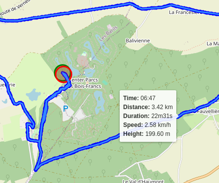

A workout tracking web application for personal use (or family, friends), geared towards running and other GPX-based
activities

Self-hosted, everything included.

Heavily inspired by [FitTrackee](https://github.com/SamR1/FitTrackee) :heart:.

## Screenshots

### Dashboard


Dashboard view with:

- personal totals
- running records
- a calendar view
- recent activities (by you and other users)

### Overview of workouts


Overview of all your activities, with summaries. The columns are sortable.

### Details of a single workout


Details of a workout, with:

- a zoomable, dragable map of the GPX track with more details per point
- many summarized statistics
- a breakdown per kilometer

### Tooltips for even more information



- green and red circle are beginning and and of the track
- every point on the track has a tooltip with a summary at that moment


### Upload your files


Upload one or multiple GPX files.
The files are parsed when uploaded, statistics and other information are calculated and stored in the database (serialized).

## What is this, technically?

A single binary that runs on any platform, with no dependencies.

The binary contains all assets to serve a web interface, through which you can upload your GPX files, visualize your
tracks and see their statistics and graphs. The web interface is multi-user (with simple authentication form, session
cookies and JWT tokens). The storage is a single SQLite database.

## What technologies are used

- Go, with some notable libraries
  - [gpxgo](github.com/tkrajina/gpxgo)
  - [Echo](https://echo.labstack.com/)
  - [Gorm](https://gorm.io)
- HTML, CSS and JS
  - [Tailwind CSS](https://tailwindcss.com/)
  - [Font Awesome](https://fontawesome.com/)
  - [FullCalendar](https://fullcalendar.io/)
  - [Leaflet](https://leafletjs.com/)
  - [sorttable](https://www.kryogenix.org/code/browser/sorttable/)
- Docker

## Configuration

The web server looks for a file `workout-tracker.yaml` (or `json` or `toml`) in the current directory, or takes it's
configuration from environment variables. The only important variable is the JWT encryption key. If you don't provide
it, the key is randomly generated every time the server starts, invalidating all current sessions.

Generate a secure key and write it to `workout-tracker.yaml`:

```bash
echo "jwt_encryption_key: $(pwgen -c 32)" > workout-tracker.yaml
```

See `workout-tracker.example.yaml` for more options and details.

## Build and run it yourself

- install go
- clone the repository

```bash
go build ./
./workouts
```

## Do some development

### Tailwind

You probably will need to install npm and Tailwind CLI

```bash
npm install -D tailwindcss
```

The Tailwind modules used are in the `node_modules` folder.

### Test, build, run

Because I keep forgetting how to build every component, I created a Makefile.

```bash
# Make everything. This is also the default target.
make all # Run tests and build all components

# Testing
make test # Runs all the tests
make test-views test-assets test-go # Run tests for the individual components

# Building
make build # Builds all components
make build-tw # Builds the Tailwind CSS output file
make build-server # Builds the web server
make build-docker # Performs all builds inside Docker containers, creates a Docker image

# Running it
make serve # Runs the compiled binary
make dev # Runs a wrapper that watches for changes, then rebuilds and restarts
make watch-tw # Runs the Tailwind CSS watcher (not useful unless you're debugging Tailwind CSS)

# Cleanin' up
make clean # Removes build artifacts
```

## TODO

- aggregated statistics and graphs
  - eg. number of kilometers per month
- add support for authentication through a reverse proxy
- internationalization
- provide a light theme
- add more activity types
- see if htmx is worth using
- make a dev-flag that doesn't embed all files in the binary
- add support for generic database drivers
- add support for other types of import files (eg. Garmin fit files)
- add support for auto-import from a folder (per user)
