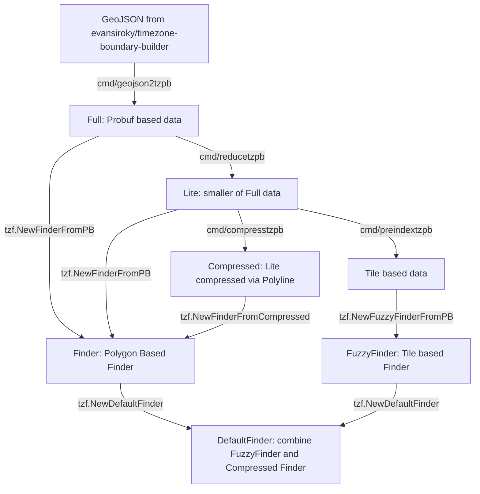

# TZF: a fast timezone finder for Go. [](https://pkg.go.dev/github.com/ringsaturn/tzf) [](https://codecov.io/gh/ringsaturn/tzf)


TZF is a fast timezone finder package designed for Go. It allows you to quickly
find the timezone for a given latitude and longitude, making it ideal for geo
queries and services such as weather forecast APIs. With optimized performance
and two different data options, TZF is a powerful tool for any Go developer's
toolkit.

---

> [!NOTE]
>
> Here are some language or server which built with tzf or it's other language
> bindings:

| Language or Sever         | Link                                                                    | Note                |
| ------------------------- | ----------------------------------------------------------------------- | ------------------- |
| Go                        | [`ringsaturn/tzf`](https://github.com/ringsaturn/tzf)                   |                     |
| Ruby                      | [`HarlemSquirrel/tzf-rb`](https://github.com/HarlemSquirrel/tzf-rb)     | build with tzf-rs   |
| Rust                      | [`ringsaturn/tzf-rs`](https://github.com/ringsaturn/tzf-rs)             |                     |
| Swift                     | [`ringsaturn/tzf-swift`](https://github.com/ringsaturn/tzf-swift)       |                     |
| Python                    | [`ringsaturn/tzfpy`](https://github.com/ringsaturn/tzfpy)               | build with tzf-rs   |
| HTTP API                  | [`ringsaturn/tzf-server`](https://github.com/ringsaturn/tzf-server)     | build with tzf      |
| HTTP API                  | [`racemap/rust-tz-service`](https://github.com/racemap/rust-tz-service) | build with tzf-rs   |
| Redis Server              | [`ringsaturn/tzf-server`](https://github.com/ringsaturn/tzf-server)     | build with tzf      |
| Redis Server              | [`ringsaturn/redizone`](https://github.com/ringsaturn/redizone)         | build with tzf-rs   |
| JS via Wasm(browser only) | [`ringsaturn/tzf-wasm`](https://github.com/ringsaturn/tzf-wasm)         | build with tzf-rs   |
| Online                    | [`ringsaturn/tzf-web`](https://github.com/ringsaturn/tzf-web)           | build with tzf-wasm |

## Quick Start

To start using TZF in your Go project, you first need to install the package:

```bash
go get github.com/ringsaturn/tzf
```

Then, you can use the following code to locate:

```go
// Use about 150MB memory for init, and 60MB after GC.
package main

import (
	"fmt"

	"github.com/ringsaturn/tzf"
)

func main() {
	finder, err := tzf.NewDefaultFinder()
	if err != nil {
		panic(err)
	}
	fmt.Println(finder.GetTimezoneName(116.6386, 40.0786))  // In longitude-latitude order
}
```

If you require a query result that is 100% accurate, use the following to
locate:

```go
// Use about 900MB memory for init, and 660MB after GC.
package main

import (
	"fmt"

	"github.com/ringsaturn/tzf"
	tzfrel "github.com/ringsaturn/tzf-rel"
	pb "github.com/ringsaturn/tzf/gen/go/tzf/v1"
	"google.golang.org/protobuf/proto"
)

func main() {
	input := &pb.Timezones{}

	// Full data, about 83.5MB
	dataFile := tzfrel.FullData

	if err := proto.Unmarshal(dataFile, input); err != nil {
		panic(err)
	}
	finder, _ := tzf.NewFinderFromPB(input)
	fmt.Println(finder.GetTimezoneName(116.6386, 40.0786))  // In longitude-latitude order
}
```

### Best Practice

It's expensive to init tzf's Finder/FuzzyFinder/DefaultFinder, please consider
reuse it or as a global var. Below is a global var example:

```go
package main

import (
	"fmt"

	"github.com/ringsaturn/tzf"
)

var f tzf.F

func init() {
	var err error
	f, err = tzf.NewDefaultFinder()
	if err != nil {
		panic(err)
	}
}

func main() {
	// In longitude-latitude order
	fmt.Println(f.GetTimezoneName(116.3883, 39.9289))
	fmt.Println(f.GetTimezoneName(-73.935242, 40.730610))
}
```

## CLI Tool

In addition to using TZF as a library in your Go projects, you can also use the
tzf command-line interface (CLI) tool to quickly get the timezone name for a set
of coordinates. To use the CLI tool, you first need to install it using the
following command:

```bash
go install github.com/ringsaturn/tzf/cmd/tzf@latest
```

Once installed, you can use the tzf command followed by the latitude and
longitude values to get the timezone name:

```bash
tzf -lng 116.3883 -lat 39.9289
```

Alternatively if you want to look up multiple coordinates efficiently you can
specify the ordering and pipe them to the tzf command one pair of coordinates
per line:

```bash
echo -e "116.3883 39.9289\n116.3883, 39.9289" | tzf -stdin-order lng-lat
```

## Data

You can download the original data from
<https://github.com/evansiroky/timezone-boundary-builder>.

The preprocessed protobuf data can be obtained from
<https://github.com/ringsaturn/tzf-rel>, which has Go's `embedded` support.
These files are Protocol Buffers messages for more efficient binary
distribution, similar to Python wheels. You can view the
[`pb/tzinfo.proto file`](./pb/tzinfo.proto) or its
[HTML format documentation][pb_html] for information about the internal format.

The data pipeline for tzf can be illustrated as follows:



The [complete dataset (~80MB)][full-link] can be used anywhere, but requires
higher memory usage.

The [lightweight dataset (~10MB)][lite-link] may not function optimally in some
border areas.

You can observe points with different outcomes on this [page][points_not_equal].

If a slightly longer initialization time is tolerable, the
[compressed dataset (~5MB)][compressed-link] derived from the lightweight
dataset will be **more suitable for binary distribution.**

The [pre-indexed dataset (~1.78MB)][preindex-link] consists of multiple tiles.
It is used within the `DefaultFinder`, which is built on `FuzzyFinder`, to
reduce execution times of the raycasting algorithm.

[pb_html]: https://ringsaturn.github.io/tzf/pb.html
[full-link]: https://github.com/ringsaturn/tzf-rel/blob/main/combined-with-oceans.bin
[lite-link]: https://github.com/ringsaturn/tzf-rel/blob/main/combined-with-oceans.reduce.bin
[preindex-link]: https://github.com/ringsaturn/tzf-rel/blob/main/combined-with-oceans.reduce.preindex.bin
[compressed-link]: https://github.com/ringsaturn/tzf-rel/blob/main/combined-with-oceans.reduce.compress.bin
[points_not_equal]: https://geojson.io/#id=gist:ringsaturn/2d958e7f0a279a7411c04907f255955a

I have written an article about the history of tzf, its Rust port, and its Rust
port's Python binding; you can view it
[here](https://blog.ringsaturn.me/en/posts/2023-01-31-history-of-tzf/).

## Performance

The tzf package is intended for high-performance geospatial query services, such
as weather forecasting APIs. Most queries can be returned within a very short
time, averaging around 2000 nanoseconds.

Here is what has been done to improve performance:

1. Using pre-indexing to handle most queries takes approximately 1000
   nanoseconds.
2. Using an RTree to filter candidate polygons, instead of iterating through all
   polygons, reduces the execution times of the Ray Casting algorithm.
3. Using a finely-tuned Ray Casting algorithm package
   <https://github.com/tidwall/geojson> to verify whether a polygon contains a
   point.

That's all. There are no black magic tricks inside the tzf package.

The benchmark was conducted using version
<https://github.com/ringsaturn/tzf/releases/tag/v0.16.0>

```
goos: darwin
goarch: arm64
pkg: github.com/ringsaturn/tzf
cpu: Apple M3 Max
BenchmarkDefaultFinder_GetTimezoneName_Random_WorldCities-16    	  823786	      1261 ns/op	      1000 ns/p50	      5000 ns/p90	      8000 ns/p99	       8 B/op	       0 allocs/op
BenchmarkFuzzyFinder_GetTimezoneName_Random_WorldCities-16      	 2239102	       572.1 ns/op	      1000 ns/p50	      1000 ns/p90	      1000 ns/p99	       8 B/op	       0 allocs/op
BenchmarkGetTimezoneName-16                                     	  423015	      2852 ns/op	      3000 ns/p50	      3000 ns/p90	      4000 ns/p99	       8 B/op	       0 allocs/op
BenchmarkGetTimezoneNameAtEdge-16                               	  399050	      3036 ns/op	      3000 ns/p50	      3000 ns/p90	      4000 ns/p99	       8 B/op	       0 allocs/op
BenchmarkGetTimezoneName_Random_WorldCities-16                  	  288864	      3867 ns/op	      4000 ns/p50	      6000 ns/p90	      8000 ns/p99	       8 B/op	       0 allocs/op
PASS
coverage: 65.5% of statements
ok  	github.com/ringsaturn/tzf	7.995s
```

- <https://ringsaturn.github.io/tzf/> displays continuous benchmarking results.
- <https://ringsaturn.github.io/tz-benchmark/> displays a continuous benchmark
  comparison with other packages.

## Related Repos

- <https://github.com/ringsaturn/tzf-rel> Preprocessed probuf data release repo
- <https://github.com/ringsaturn/tz-benchmark> Continuous Benchmark Compared
  with other packages
- <https://github.com/ringsaturn/tzf-rs> Rust port of tzf
- <https://github.com/ringsaturn/tzfpy> Rust port's Python binding
- <https://github.com/ringsaturn/tzf-server> HTTP&Redis server build with tzf
- <https://github.com/ringsaturn/redizone> Redis compatible server build with
  tzf-rs

## Thanks

- <https://github.com/paulmach/orb>
- <https://github.com/tidwall/geojson>
- <https://github.com/jannikmi/timezonefinder>
- <https://github.com/evansiroky/timezone-boundary-builder>

## LICENSE

This project is licensed under the [MIT license](./LICENSE) and
[Anti CSDN License](./LICENSE_ANTI_CSDN.md)[^anti_csdn]. The data is licensed
under the
[ODbL license](https://github.com/ringsaturn/tzf-rel/blob/main/LICENSE), same as
[`evansiroky/timezone-boundary-builder`](https://github.com/evansiroky/timezone-boundary-builder)

[^anti_csdn]: This license is to prevent the use of this project by CSDN, has no
    effect on other use cases.
